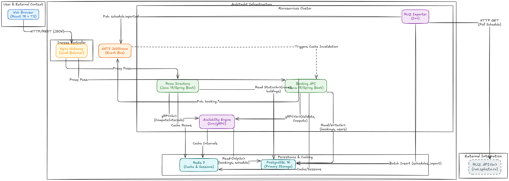
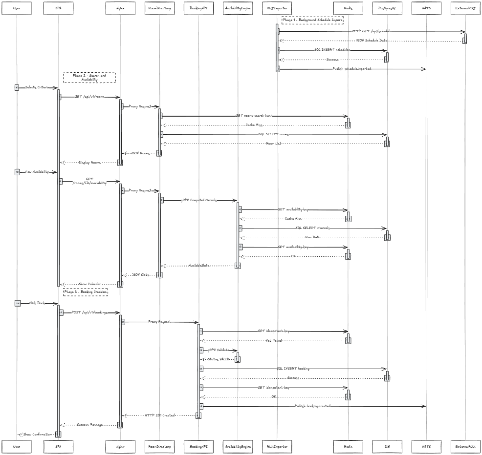

# 🎓 Система бронирования аудиторий СПбПУ

---

## 📋 Problem Definition

Студенты и преподаватели СПбПУ сталкиваются с проблемой поиска свободных аудиторий для учебных и внеучебных мероприятий, так как отсутствует централизованная система бронирования, интегрированная с расписанием занятий. Существующая система RUZ API не предоставляет функционал уведомлений о доступности аудиторий и не позволяет пользователям самостоятельно создавать бронирования. Текущий процесс бронирования требует ручного согласования с администраторами, что создает задержки и неудобства для всех участников процесса.

---

## 👥 User Stories

### 🔍 US-1: Поиск свободных аудиторий
**Как** студент или преподаватель,
**Я хочу** найти свободные аудитории на определенную дату и время,
**Чтобы** выбрать подходящее помещение для своего мероприятия.

**✅ Критерии приемки:**
- Система отображает список доступных аудиторий с учетом занятости по расписанию
- Поиск поддерживает фильтрацию по корпусу, вместимости и характеристикам
- Результаты отображаются с временными слотами доступности

### 📅 US-2: Создание бронирования
**Как** авторизованный пользователь,
**Я хочу** создать бронирование аудитории на выбранное время,
**Чтобы** зарезервировать помещение для своего мероприятия.

**✅ Критерии приемки:**
- Система проверяет доступность аудитории на указанный временной интервал
- Бронирование создается только при отсутствии конфликтов с существующими бронями и расписанием
- Пользователь получает подтверждение о создании бронирования

### ❌ US-3: Отмена бронирования
**Как** владелец бронирования,
**Я хочу** отменить свое бронирование,
**Чтобы** освободить аудиторию для других пользователей.

**✅ Критерии приемки:**
- Пользователь может отменить только свои бронирования
- При отмене система автоматически освобождает временной слот
- Другие пользователи могут увидеть освободившуюся аудиторию в результатах поиска

---

## 📊 Load Estimation

### Расчет нагрузки для 10,000 DAU (Daily Active Users)

#### Предположения:
- **DAU (Daily Active Users):** 10,000 пользователей
- **Peak hours:** 4 часа в день (08:00-12:00)
- **Average session duration:** 5 минут
- **Requests per session:** 10 запросов
- **Read/Write ratio:** 80% Read, 20% Write

#### 🚀 Расчет RPS (Requests Per Second):

**Общее количество запросов в день:**
```
10,000 DAU × 10 requests/session = 100,000 requests/day
```

**Пиковая нагрузка (4 часа):**
```
100,000 requests / (4 hours × 3600 seconds) = ~7 RPS (average)
Peak factor (×3): 7 × 3 = 21 RPS
```

**Разделение по типам:**
- **Read requests:** 21 × 0.8 = **16.8 RPS**
- **Write requests:** 21 × 0.2 = **4.2 RPS**

#### 💾 Объем данных за 5 лет:

**Бронирования:**
```
10,000 DAU × 2 bookings/month × 12 months × 5 years = 1,200,000 bookings
Average booking record size: ~500 bytes
Total bookings data: 1,200,000 × 500 bytes = 600 MB
```

**Логи аудита:**
```
100,000 requests/day × 365 days × 5 years = 182,500,000 log entries
Average log entry size: ~200 bytes
Total logs data: 182,500,000 × 200 bytes = 36.5 GB
```

**Общий объем данных:**
```
Bookings: 600 MB
Logs: 36.5 GB
Metadata (users, rooms, etc.): ~100 MB
Total: ~37.2 GB за 5 лет
```

**С учетом индексов и overhead:**
```
Estimated total storage: ~50 GB за 5 лет
```

---

## 🏗️ Architecture

### 🧩 UML Component Diagram



### 🔄 Sequence Diagram



### 🗄️ Схема базы данных


#### 📋 Основные таблицы:

1. **users** - Пользователи системы
   - `id` (UUID), `email`, `password_hash`, `firstname`, `lastname`, `role`, `is_active`, `created_at`, `updated_at`
   - Индексы: `email` (unique), `role`

2. **buildings** - Здания университета
   - `id` (UUID), `code`, `name`, `address`
   - Индексы: `code` (unique)

3. **rooms** - Аудитории
   - `id` (UUID), `building_id` (FK), `name`, `code`, `capacity`, `features` (JSONB)
   - Индексы: `building_id`, `code` (composite unique через constraint)

4. **bookings** - Бронирования
   - `id` (UUID), `user_id` (FK), `room_id` (FK), `starts_at`, `ends_at`, `status`, `created_at`, `updated_at`
   - Индексы: `user_id`, GIST exclusion constraint на `(room_id, tstzrange(starts_at, ends_at))`

5. **schedules_import** - Импортированное расписание
   - `id` (UUID), `room_id` (FK), `starts_at`, `ends_at`, `source`, `hash`, `metadata` (JSONB), `updated_at`
   - Индексы: `room_id`, GIST на `tstzrange(starts_at, ends_at)`

#### 🤔 Обоснование выбора PostgreSQL:

1. **ACID транзакции** - Гарантируют целостность данных при создании бронирований
2. **GIST индексы** - Нативная поддержка для предотвращения пересечений временных интервалов через exclusion constraints
3. **JSONB поддержка** - Гибкое хранение метаданных (features комнат, metadata логов)
4. **Масштабируемость** - Поддержка репликации, партиционирования, connection pooling
5. **Расширяемость** - Возможность добавления расширений (uuid-ossp, btree_gist)
6. **Производительность** - Оптимизированные запросы с индексами, materialized views для аналитики

### ⚡ Стратегия масштабирования (Scale out ×10)

#### 🔄 Горизонтальное масштабирование компонентов:

**🎯 1. Stateless сервисы (легко масштабируются):**
- **Booking API:** 1 → 10 инстансов (×10)
  - Load balancer (Nginx) распределяет запросы
  - Shared Redis для сессий
  - Connection pooling к PostgreSQL (20 connections × 10 = 200 total)

- **Room Directory:** 1 → 10 инстансов (×10)
  - Read-heavy нагрузка, легко масштабируется
  - Redis cache снижает нагрузку на БД

- **Frontend:** 1 → 5 инстансов (×5)
  - Статические файлы через CDN
  - Nginx load balancing

**💾 2. Stateful сервисы (требуют особого подхода):**
- **Availability Engine:** 1 → 5 инстансов (×5)
  - gRPC load balancing (round-robin)
  - Shared Redis cache для результатов вычислений
  - Read replicas PostgreSQL для снижения нагрузки

- **PostgreSQL:**
  - Primary: 1 инстанс (write operations)
  - Read replicas: 3 инстанса (read operations)
  - Connection pooling: PgBouncer (200 → 2000 connections)

- **Redis:**
  - Redis Cluster: 3 master + 3 replica nodes
  - Sharding по ключам (room_id hash)

- **NATS:**
  - NATS Cluster: 3 nodes
  - JetStream replication factor: 3

#### 📈 Ожидаемая производительность после масштабирования:

```
Исходная нагрузка: 21 RPS
После масштабирования (×10): 210 RPS capacity

Read requests: 168 RPS (16.8 × 10)
Write requests: 42 RPS (4.2 × 10)

Latency targets:
- Room search (cached): p95 < 100ms
- Availability check (cached): p95 < 300ms
- Availability check (DB): p95 < 700ms
- Booking creation: p95 < 1000ms
```

#### 📊 Мониторинг масштабирования:

- **Метрики:** CPU, Memory, Request rate, Error rate
- **Автоскейлинг:** Kubernetes HPA или Docker Swarm на основе CPU/Memory
- **Алерты:** При превышении 80% capacity запуск дополнительных инстансов

---

## 🛠️ Технологический стек

- **Backend:** Java 17 (Spring Boot 3.4), C++17 (gRPC)
- **Frontend:** React 18, TypeScript, Vite
- **Database:** PostgreSQL 16
- **Cache:** Redis 7
- **Message Broker:** NATS JetStream
- **Containerization:** Docker, Docker Compose
- **Build Tools:** Maven, CMake, Make

---

## 🚀 Быстрый старт

### 📋 Предварительные требования

- Docker 20.10+
- Docker Compose 2.0+
- Make (опционально)

### ▶️ Запуск проекта

```bash
# Сборка всех образов (с очисткой кэша и обновлением базовых образов)
make build

# Запуск тестов в контейнере
make test

# Запуск всех сервисов (с очисткой старых контейнеров)
make run

# Или все сразу: build → test → run
make all

# Дополнительные команды:
make up        # Запуск с пересборкой (--build)
make down      # Остановка всех сервисов
make logs      # Просмотр логов всех сервисов
make ps        # Статус контейнеров
make clean     # Очистка volumes и сетей
```

### 🌐 Доступ к сервисам

- **Frontend:** http://localhost:3000
- **Booking API:** http://localhost:8081
- **PostgreSQL:** localhost:5432
- **Redis:** localhost:6379
- **NATS:** localhost:4222
- **Availability Engine (gRPC):** localhost:50051

---

## 💻 Разработка

### 📁 Структура проекта

```
spbstu-room-booking/
├── booking_API/          # Java Spring Boot сервис
├── availability_engine/  # C++ gRPC сервис
├── frontend/             # React приложение
├── infrastructure/      # Docker конфигурации
├── docker-compose.yml    # Оркестрация сервисов
├── Makefile             # Автоматизация сборки
└── README.md            # Документация
```

### 🔧 Локальная разработка

```bash
# Запуск только инфраструктуры (БД, Redis, NATS)
make up postgres redis nats

# Или через docker-compose
docker-compose up -d postgres redis nats

# Запуск Java сервиса локально
cd booking_API && ./mvnw spring-boot:run

# Запуск C++ сервиса локально
cd availability_engine && mkdir -p build && cd build && cmake .. && make -j$(nproc)

# Запуск тестов
make test

# Просмотр логов
make logs
```

